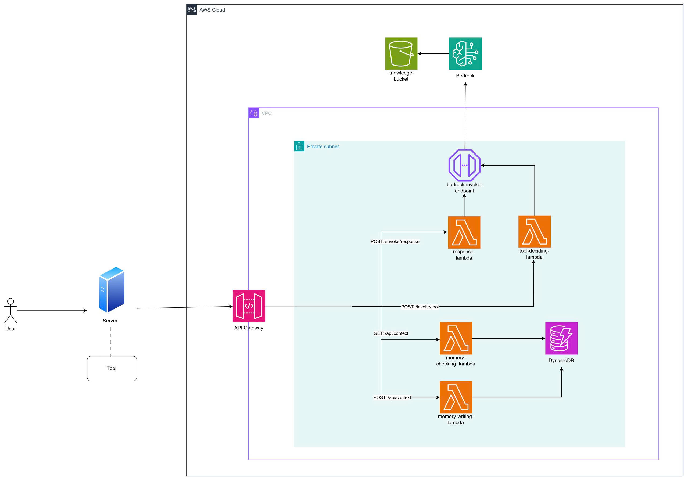
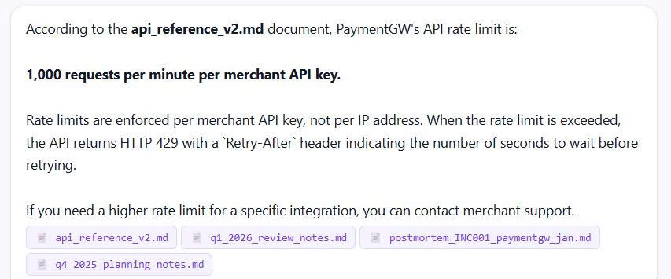
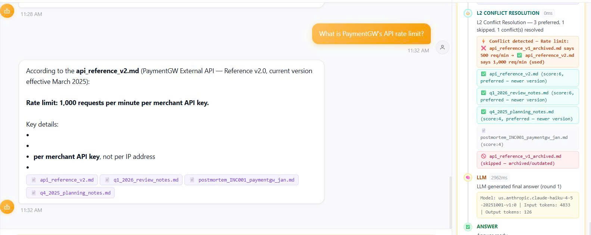
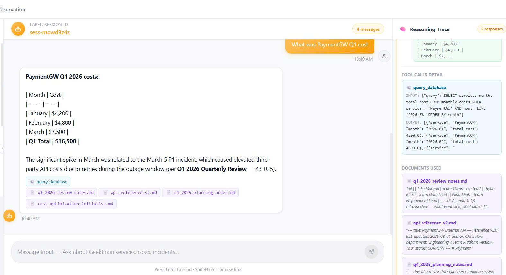
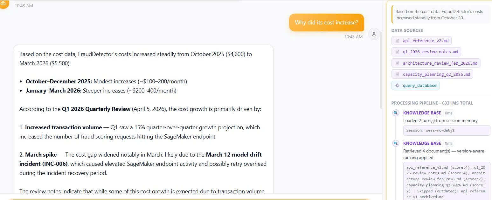
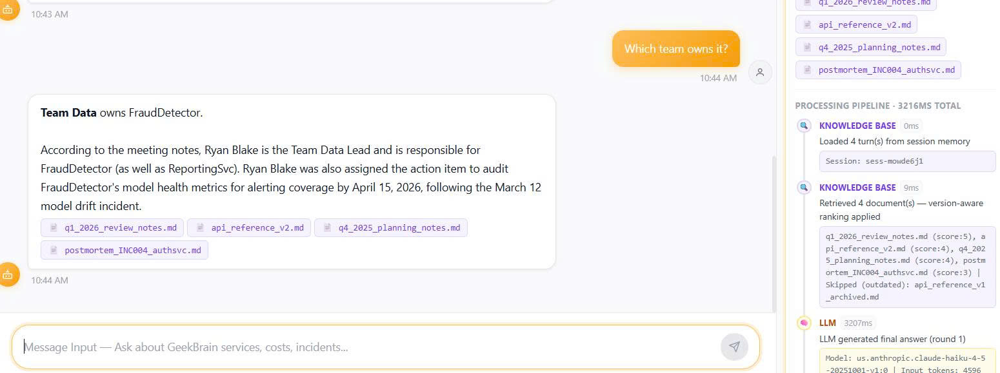
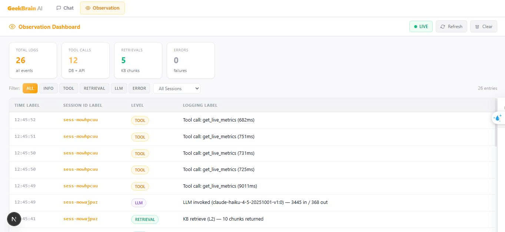

#### 1. COVER

### Group Information
- Group number: 15
- Members:
  - Phạm Vũ Khánh Trường
  - Ka Phu Đông
  - Nguyễn Thị Tiểu Phương
  - Văn Phú Tín 
  - Phan Văn Duy 
  - Hà Tây Nguyên 
  - Nguyễn Đình Thi
  - Võ Lê Trường Huy 
  - Châu Thành Trung 

#### 2. ARCHITECTURE  

### Data Flow
1. User asks question
2. Load Context
3. Retrieve data & Execute Tool
4. LLM generates answer
5. Response returned to UI

### Screenshot:


#### 3. L1 Evidence(RAG)

### Screenshot


### Question
What is the API rate limit for PaymentGW?

### Retrieved Documents
- api_reference_v2.md
- q1_2026_review_notes.md
- postmortem_INC001_paymentgw_jan.md
- q4_2025_planning_notes.md

### Conflict Resolution
The system retrieved multiple documents related to PaymentGW configuration and rate limiting policies.
After comparing the retrieved sources, the system selected the latest and most authoritative information from `api_reference_v2.md`.

### Final Answer
PaymentGW API rate limit is **1,000 requests per minute per merchant API key**.
Additional details:
- Rate limits are enforced per merchant API key
- Exceeding the limit returns HTTP 429
- The response includes a `Retry-After` header


#### 4. L2 Evidence (Multi-document)

### Screenshot


### Question
What was PaymentGW Q1 cost?

### Tool Used
Database Query Tool (`query_database`)

### SQL Executed
```sql
SELECT service, month, total_cost
FROM monthly_costs
WHERE service = 'PaymentGW'
AND month LIKE '2026-0%'
ORDER BY month;
```
#### 6. L3 Evidence (Tool Use)

### Screenshot


### Question
What was PaymentGW Q1 cost?

### Tool Used
Database Query Tool (`query_database`)

### Tool Call Detail

```sql
SELECT service, month, total_cost
FROM monthly_costs
WHERE service = 'PaymentGW'
AND month LIKE '2026-0%'
ORDER BY month; 
```

#### 5. L4 Evidence (Memory)

### Screenshot 1


### Turn 1
**Question:** Which service had highest cost?

**Answer:**  
FraudDetector had the highest total cost at **$30,200**.

---

### Turn 2
**Question:** Why did its cost increase?

**Answer:**  
The system correctly remembered that **“its” refers to FraudDetector** from the previous conversation turn.

FraudDetector's' costs increased steadily from October 2025 to March 2026:
- October–December 2025: modest increases (~$100–200/month)
- January–March 2026: steeper increases (~$200–400/month)

According to the Q1 2026 Quarterly Review, the increase was primarily caused by:
- increased transaction volume
- higher SageMaker inference usage
- infrastructure scaling requirements
- elevated retry overhead during the March 12 model drift incident (INC-006)

---

### Screenshot 2


### Memory & Retrieval Trace
The processing pipeline confirmed that the system:
- loaded 2 previous conversation turns from session memory
- retrieved 4 related documents
- applied version-aware ranking
- ignored outdated archived references

### Retrieved Documents
- api_reference_v2.md
- q1_2026_review_notes.md
- architecture_review_feb_2026.md
- capacity_planning_q2_2026.md

Skipped outdated document:
- api_reference_v1_archived.md

---

### Screenshot 3


### Turn 3
**Question:** Which team owns it?

**Answer:**  
The system correctly remembered that **“it” refers to FraudDetector** from the previous conversation context.

Team Data owns FraudDetector.

Additional retrieved context identified:
- Ryan Blake as Team Data Lead
- responsibility for FraudDetector and ReportingSvc
- assigned audit tasks after the March 12 model drift incident

### Processing Pipeline
- Loaded 4 turn(s) from session memory
- Retrieved 4 related documents
- Applied version-aware ranking
- Ignored outdated archived references

### Retrieved Documents
- q1_2026_review_notes.md
- api_reference_v2.md
- q4_2025_planning_notes.md
- postmortem_INC004_authsvc.md

### LLM Trace
- Model: `us.anthropic.claude-haiku-4-5`
- Final answer generated successfully in round 1


#### 7. Bonus A — Observability Dashboard

### Screenshot 3

### Dashboard Overview
The system includes a real-time observation dashboard for monitoring:
- LLM activity
- retrieval events
- tool calls
- session tracking
- error logging
- token usage
- execution latency

### Observed Metrics
- Total Logs: 29
- Tool Calls: 14
- Retrieval Events: 5
- Active Sessions:
  - `sess-mowhpcuu`
  - `sess-mowajpuz`

### LLM Monitoring
The dashboard tracked multiple LLM invocations using:
- `us.anthropic.claude-haiku-4-5-20251001-v1:0`

Example trace:
- Input tokens: 11,780
- Output tokens: 761
- Duration: 34,024 ms

### Features Demonstrated
- live logging and refresh
- session-based tracing
- retrieval monitoring
- tool execution tracking
- token usage inspection
- latency measurement
- centralized debugging interface

### System Flow Observed
User Query → Retrieval → Tool Call → LLM Processing → Final Response

### Purpose
This observability layer helped the team:
- debug agent workflows
- inspect LLM reasoning behavior
- monitor retrieval and tool execution
- detect failures and performance bottlenecks
- improve transparency and explainability of the system


#### 8. Reflection

### Hardest Level
The most challenging part of the project was **L3 (Tool Integration)**.

### Why
Unlike a standard RAG pipeline that only retrieves information from a Knowledge Base, L3 required the system to interact with external tools and structured databases.

The team had to design a workflow where the LLM could:
- understand when a tool should be used
- generate correct tool inputs and SQL queries
- combine database outputs with retrieved contextual documents
- avoid hallucinated values during tool execution

One of the main challenges was ensuring reliability. Even small mistakes in tool parameters or SQL generation could lead to incorrect outputs or failed execution.

### What We Would Improve
If given more development time, the team would:
- design a more advanced multi-step agent workflow
- use multiple specialized LLM roles for retrieval, reasoning, and verification
- add stronger validation and retry mechanisms for tool calls
- improve observability and trace logging for debugging and monitoring

These improvements would help produce more accurate, reliable, and explainable responses.